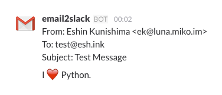

# email2slack

[](https://badge.fury.io/py/email2slack)
[](https://travis-ci.org/mikoim/email2slack)
[](https://coveralls.io/github/mikoim/email2slack?branch=master)

MIME E-mail forwarding script for Slack written in Python.

## Demo



## Requirements

- Python
  - Python 2.x >= 2.7
  - Python 3.x >= 3.3
- nkf (Optional): https://pypi.python.org/pypi/nkf/

## Getting Started

### Install email2slack

#### From PyPI

```bash
# Install email2slack
pip install email2slack --upgrade

# Fetch configuration file from GitHub
cd /usr/local/etc/
curl -O https://raw.githubusercontent.com/mikoim/email2slack/master/contrib/email2slack

# Before using, You must edit config file
vim /usr/local/etc/email2slack
```

In this case, setuptools create script to call email2slack and place it in ```bin``` directory automatically.
So you should use the script in Setup MTA section.

#### From GitHub repository

```bash
git clone https://github.com/mikoim/email2slack.git
cd email2slack

# Install email2slack
pip install .
cp contrib/email2slack /usr/local/etc/

# Before using, You must edit config file
vim /usr/local/etc/email2slack
```

#### Optional: Install nkf

```bash
pip3 install nkf
```

### Setup MTA

#### Postfix

```bash
vim /etc/postfix/aliases

...

# notify only, not forward
user: |/usr/local/bin/email2slack.py

# notify and forward e-mail to another user
user: anotheruser, |/usr/local/bin/email2slack.py

# notify and leave e-mail on same user
user: \user, |/usr/local/bin/email2slack.py

# you can override default slack url, team and channel with command line option,
# which replace as default=value in each section.
# -s url / --slack url
# -t team-name / --team team-name
# -c channel-name / --channel channel-name
# -f /path/to/email2slack.conf / --config /path/to/email2slack.conf
user: "|/usr/local/bin/email2slack.py -c '@user'"
another: "|/usr/local/bin/email2slack.py -c '#random'"

...

newaliases
```

## Contributors

Thank you for your great work!

- @komeda-shinji
