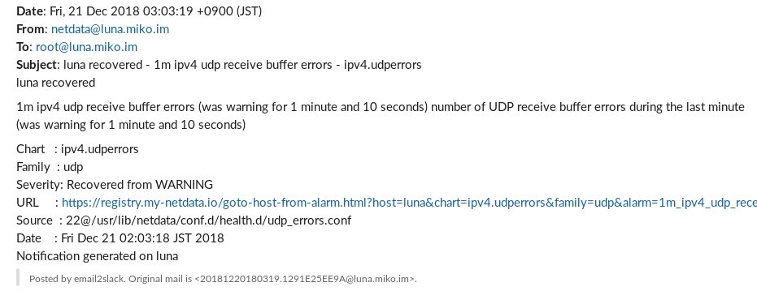

# email2slack

[](https://badge.fury.io/py/email2slack)
[](https://travis-ci.org/mikoim/email2slack)
[](https://coveralls.io/github/mikoim/email2slack?branch=master)

MIME E-mail forwarding script for Slack(webhook) written in Python.

## Demo

### Fail2Ban (plain text)


### netdata (HTML)



## Requirements

- Python
  - Python 2 >= 2.7
  - Python 3 >= 3.4

## Getting Started

### Prerequisites

#### (Optional) Use faster HTML parser than pure Python

Installation of email2slack requires `gcc` and the development packages of both
`libxml2` and `libxslt`. On RedHat based systems you can install these using
`sudo yum install gcc libxml2-devel libxslt-devel`. On Ubuntu systems you can
install using `sudo apt-get install build-essential libxml2-dev libxslt-dev`.
If you are using some other system there are probably similar packages available.

#### (Optional) Use nkf to convert character encoding for non Unicode message
 
nkf binding module (https://pypi.org/project/nkf/) also requires `gcc` and
`Python development headers` to build C extension. On RedHat based systems you
can install these using `sudo yum install gcc python-devel`. On Ubuntu systems
you can install using `sudo apt-get install python python-pip`.

### Install email2slack

#### From PyPI

```bash
# Install email2slack
pip install -U email2slack  # without any optional modules
pip install -U email2slack[lxml]  # use lxml
pip install -U email2slack[nkf]  # use nkf
pip install -U email2slack[lxml,nkf]  # both

# Fetch configuration file from GitHub
curl https://raw.githubusercontent.com/mikoim/email2slack/master/contrib/email2slack > /usr/local/etc/email2slack

# Before using, You must edit config file
vim /usr/local/etc/email2slack
```

In this case, setuptools create script to call email2slack and place it in
```bin``` directory automatically. So you should use the script in Setup MTA
section.

#### From GitHub repository

```bash
git clone https://github.com/mikoim/email2slack.git
cd email2slack

# Install email2slack
pip install -U .  # without any optional modules
pip install -U .[lxml]  # use lxml
pip install -U .[nkf]  # use nkf
pip install -U .[lxml,nkf]  # both
cp contrib/email2slack /usr/local/etc/

# Before using, You must edit config file
vim /usr/local/etc/email2slack
```

### Setup MTA

#### Postfix

```bash
vim /etc/postfix/aliases

...

# notify only, not forward
user: |/usr/local/bin/email2slack

# notify and forward e-mail to another user
user: anotheruser, |/usr/local/bin/email2slack

# notify and leave e-mail on same user
user: \user, |/usr/local/bin/email2slack

# you can override default slack url, team and channel with command line option,
# which replace as default=value in each section.
# -s url / --slack url
# -t team-name / --team team-name
# -c channel-name / --channel channel-name
# -f /path/to/email2slack.conf / --config /path/to/email2slack.conf
user: "|/usr/local/bin/email2slack -c '@user'"
another: "|/usr/local/bin/email2slack -c '#random'"

...

newaliases
```

## Contributors

Thank you for your great work!

- @komeda-shinji
- @mmrwoods
